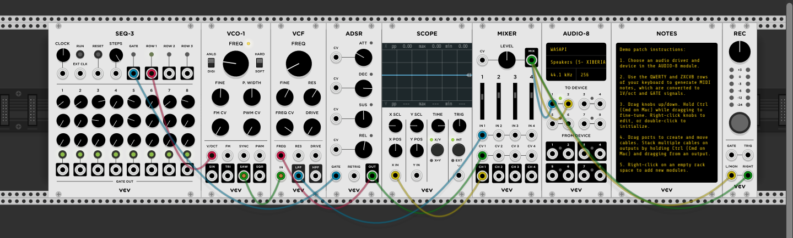

# My First VCV Rack Assignment

1. In the **Screenshot** section, make sure the filename is correct
2. In the **Link to Sound File** section, replace the URL with yours (from step 3 above)
3. In the **Notes** section at the bottom, add any notes you want to include
4. Change the title at the top of the file to something descriptive of your project
5. Remove this **How to Submit** section

## Screenshot

## Link to Sound File

https://archive.org/details/meow-type-beat

## Notes
It's a meow type beat. 
